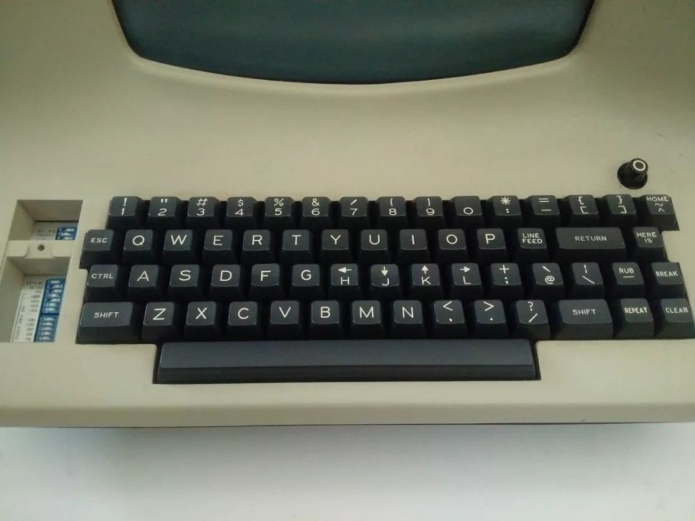
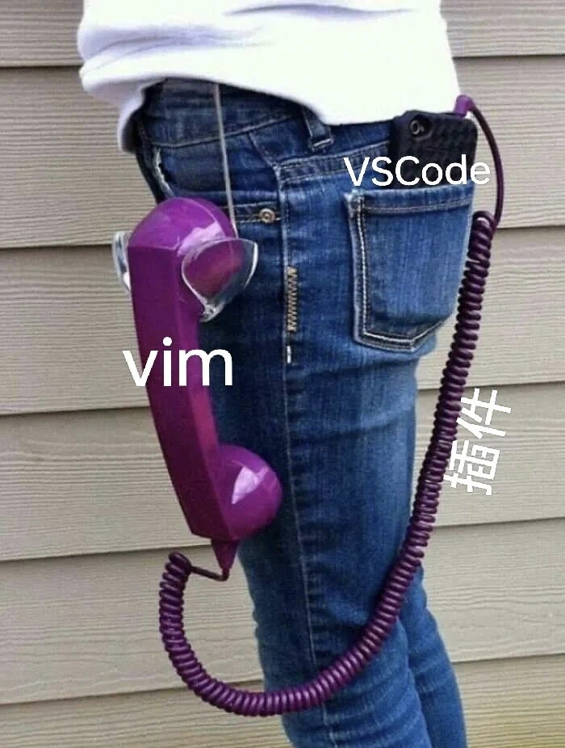

# Vim Workshop

By ？

time?

---

## Part 0 -- Intro

### Our aim

Learn how to use vim in your future project, and **THOWR YOUR MOUSE**. 

### What is vim

- An editor
- vi -> visual interface
- vim -> vi Improved

---

As you can see from the advertisement of this workshop, vim has many short-cuts and other fabulous functions that can aid our programming.

### Why vim

- No switch between keyboard and mouse
- Easy to move
- No duplicate operation

### How to learn vim

Practice Practice Practice. 

From a small program ~~or from an English essay~~

## Part 1 -- Basic Operation

### Menu

- [Vim Workshop](#vim-workshop)
  - [Part 0 -- Intro](#part-0----intro)
    - [Our aim](#our-aim)
    - [What is vim](#what-is-vim)
    - [Why vim](#why-vim)
    - [How to learn vim](#how-to-learn-vim)
  - [Part 1 -- Basic Operation](#part-1----basic-operation)
    - [Menu](#menu)
    - [Before Start](#before-start)
    - [Mode Intro](#mode-intro)
    - [Normal Mode](#normal-mode)
    - [Why key in vim is so uncomfortable?](#why-key-in-vim-is-so-uncomfortable)
    - [Insert Mode](#insert-mode)
    - [Life Hack](#life-hack)
    - [Visual Mode](#visual-mode)
    - [Replace Mode\*](#replace-mode)
    - [Command Mode](#command-mode)
  - [Part 2 -- vimrc](#part-2----vimrc)
    - [Without Plugin](#without-plugin)
      - [Shortcut key\&key mapping](#shortcut-keykey-mapping)
    - [With Plugin](#with-plugin)
    - [Vim Macro](#vim-macro)
    - [Suggestions](#suggestions)
    - [Other vim](#other-vim)
    - [Throw Away Your Mouse！](#throw-away-your-mouse)

### Before Start

1. Use `:help`

   You can use the command in the vim just like what you've done in the matlab

2. Vimtutor

   You can type `vimtuor` in your terminal to start the vimtutor, a tutor for vim with language related to your system language. It only takes you about 25~30 min. If you feel just give it a try if you want to go over the basic command of vim.

3. [Official Website](https://www.vim.org/)

    Community is an important part of editor. There are a lot of good quality resource made by the developers and experienced vimers on the official website. You can join the community or search on the official website to get supported.

4. [Vim Adventure](https://vim-adventures.com/)

    Vim adventure is a great game intended to help beginners to learn the vim with fun. Since it is non-free, you can pay for the rest of the game or find a reverse engineered version.

5. [Openvim](https://openvim.com)

6. [Cheatsheet](https://devhints.io/vim)

7. You should know how to work in a terminal.

    To get a quick start, we recommned you use our sample config file.

    ```bash
    cd ~/
    git clone git@github.com:TechJI-2023/Vim_wksp_2024.git
    mkdir ~/.vim
    cp ~/Vim_wksp_2024/vimrc-noplugin/vimrc ~/.vim/vimrc
    cd ~/.vim
    vim ~/.vimrc
    # Then quit by using :q
    ```

---

### Mode Intro

1. Insert Mode
2. Normal Mode
3. Visual Mode
4. Replace Mode*
5. Command Mode

### Insert Mode

```bash
vim ./test-Vim/article.txt
```

1. Open Insert Mode:
   1. `i`: insert
   2. `a`: append
   3. `o`: insert in next line
   4. `A`: append at the end of the line
   5. `I`: insert text before the first non-blank in the line
   6. `O`: insert in previous line
   7. `s`: delete char and insert
   8. `S`: delete line and insert
   9. `c`: `c` is equal to "change". `c` is motion like `d` and `y`.
   10. `C`: delete until the end of the line and insert

2. Exit Insert Mode
   1. Press `Esc`: exit insert mode
   2. ctrl c: exit insert mode and abort current command

### Normal Mode

1. Navigating
   1. Basic: hjkl

      You can use `hjkl` to replace the direction key on your key board.

      `h` for ⬅️, `j` for ⬇️, `k` for ⬆️, `l` for ➡️

   2. Word: bwe

      You can use the wbe to jump word by word.

      Difference between `word` and `WORD`: The `word` is the combination of (a-zA-Z0-9), or the combination of punctuation and character like `@##$%` while the WORD is any non-empty string between the white-space.

      NOTE THAT `as213df%##^>?^&` is two `word`, `as213df` and `%#^>?^&`.

      - `w`: go to the beginning of next word
      - `b`: go to the beginning of previous word
      - `e`: go to the end of the word
      - `W`: go to the  beginning of next WORD
      - `B`: go to the beginning of previous WORD
      - `E`: end of the WORD

   3. Line: 0, ^, $

      - `0`: Go to the beginning of line
      - `^`: Go to the beginning of line (after whitespace)
      - `$`: Go to the end of line

   4. Char:

      - `f{char}`: Go forward to character
      - `F{char}`: Go backward to character

   5. Document

      - `gg`: First line
      - `G`: Last line
      - `:{number}`: Go to line {number}
      - `{number}G`: Go to line {number}
      - `{number}j`: Go down {number} lines
      - `{number}k`: Go up {number} lines

   6. Window

      - `zz`: Center this line
      - `zt`: Top this line
      - `zb`: Bottom this line
      - `H`: Move to top of screen
      - `M`: Move to middle of screen
      - `L`: Move to bottom of screen

2. Clipboard:
   1. `x`: Delete the character
   2. `dd`: Cut the line
   3. `yy`: Yank line
   4. `p`: Paste
   5. `P`: Paste before
   6. `"*p / "+p:` Paste from system clipboard
   7. `"*y / "+y`: Paste to system clipboard

   **Note:** For users using wsl, you may encounter some problems when using the clipboard, this issue cannot be solved by part2

3. Editing

   1. `u`: You can use `u` to undo the editing
   2. `<C-R>`: You can use `<C-R>` to redo the editing

4. Opeartors

   >Operators let you operate in a range of text (defined by motion). These are performed in normal mode.

   For Example:

   |Operator|Motion|
   |---|---|
   |`d`|`w`|
   |`c`|`w`|
   |`dl`|delete character (alias: "x")|
   |`dw`|delete next word|
   |`dW`|delete next WORD|
   |`diw`|delete inner word|
   |`daw`|delete a word|
   |`diW`|delete inner WORD|
   |`daW`|delete a WORD|
   |`db`|delete to beginning of the word|
   |`dgn`|delete the next search pattern match|
   |`dd`|delete one line(actually cut one line)|
   |`dis`|delete inner sentence|
   |`das`|delete a sentence|
   |`dib`|delete inner '(' ')' block|
   |`dab`|delete a '(' ')' block|
   |`dip`|delete inner paragraph|
   |`dap`|delete a paragraph|
   |`diB`|delete inner '{' '}' block|
   |`daB`|delete a '{' '}' block|

- Text Objects

   |key|Object|
   |---|---|
   |p|Paragraph|
   |w|Word|
   |s|Sentence|
   |[ ( { < A [], (), or {}|block|
   |' " `|A quoted string|
   |b|A block (|
   |B|A block in {|
   |t|A XML tag block|

- Sentence and Paragraph in vim

   For more combinations, use `:help motion.txt`

   You can repeat the command by assigning a number.

   For example: 3dd means delete three lines.Times of repetition should be the multiplication of the numbers. Eg. 2y3y means yank 6 lines.


### Why key in vim is so uncomfortable?



### Life Hack

- Use `.` to repeat previous edit
- Use `:!` to run command in terminal
- Use `:r` to insert the file below the cursor
- Change `esc` with `capslock`

### Visual Mode

1. Visual Mode `v`

   Start Visual mode per character.

2. Visual Line Mode `V` (`shift`+`v`)

   Start Visual mode linewise.

3. Visual Block Mode (`ctrl`+`v`)

   Start Visual mode blockwise.

4. Use `gu` (lowercase) and `gU`(uppercase).

5. Use `>` and `<`(change indentation)

6. d, y, c, o in the visual mode

**Exercise**

Change `wallpaper.txt`

```txt
wallpaper_1.jpg
wallpaper_1.jpg
......
wallpaper_1.jpg
```

Into

```txt
Wallpaper_1.jpg
Wallpaper_1.jpg
......
Wallpaper_1.jpg
```

### Replace Mode*

You can use `r` to replace a character.

You can use `R` to enter the replace mode.

### Command Mode

1. Exiting Vim:
   1. `:q`: quit the file
   2. `:qa`: quit all the file
   3. `:w`: Write(Save the file)
   4. `:wq`: Write and quit the file
   5. `:x`: Write and quit the file(only write when there is change).
   6. `ZZ`: Save and quit（the same to :x)
   7. `ZQ`: Quit without checking changes
   8. `!`: You can add a `!` at the end of the command to do the command by force. For example to quit the file by force, you can use `:q!`

2. Call the terminal

   You can call the terminal by using the command `:term`. You can also use term to run command like compiling a c-file. For example:

   ```vim
   :term gcc vim.c
   :term ./a.out
   ```

   You can also open a terminal window in the vim using the command; `:term`

   You can use command to determine the position of the terminal. For example:

   ```vim
   :belowright term ++rows=10
   ```


3. Run Vim command

   Believe it or not, vim has its own language. You can use the command of vim to personalize your vim. This part will be included in the `Modify .vimrc(noplugin)`

- Search

   You can use search the string by entering `/` and `?`

   Difference between `/` and `?`:  
   `/` means search from top to bottom,  
   `?` means search from bottom to top.

   For example, you can use /\\<hello\\> to search the word `hello` from top to bottom

   - `n`: Search for the next pattern
  - `N`: Previous match
  - `*`: Next whole word under cursor
  - `#`: Previous whole word under cursor
  
   You can use \\<{word}\\> to search for the "word"

  - range is the searching range, You can define the range in following way:

      ```vim
      {start},{end}
      ```
  
      There are some characters have special meaning when defining the range:

      `%` stands for all the lines in the file

      `.` stands for the current line

      `$` stand for the last line in the file
  
      If range is not set, subtitute will only happens on the current line.

  - `s` stands for substitute

  - Commonly used flags
    - `g`: Replace all occurrences in the line. Without this argument, replacement occurs only for the first occurrence in each line.
    - `i`: Ignore case for the pattern.
    - `I`: Don't ignore case for the pattern.
    - `n`: Report the number of matches, do not actually substitute.

   Example:

   ```vim
   "replace all int with double
   :%s/int/double/g
  
   "replace first int in each line with double
   :%s/int/double/
  
   "replace all int in line1-line3 with double
   :1,3s/int/double/g
  
   "replace all int from current line to the next 4 line with double
   :.,.+4s/int/double/g
  
   "do :%s/int/double/g for 4 times(from current line to current+3 line)
   :%s/int/double/g4
   ```
  
   For more information, you can type `:help substitute` in vim.
  

## Part 2 -- vimrc

### Without Plugin

See -> `Vim_wksp_2024/vimrc-noplugin/vimrc`

We strongly suggest you do this:

```
cd ~/
git clone git@github.com:TechJI-2023/Vim_wksp_2024.git
mkdir ~/.vim
cp ~/Vim_wksp_2024/vimrc-noplugin/vimrc ~/.vim/vimrc
cd ~/.vim
vim ~/.vimrc
```

Now your vim should be look like this


Next `:q`

And `vim vimrc`

Read it line by line! (cover `split` btw)

#### Shortcut key&key mapping

1. `map` Equivalent key

`noremap` Change key 

change`a` into`b`

```
noremap a b
```

Move faster!

```
noremap H 5h
noremap J 5j
noremap K 5k
noremap L 5l
```

Quick save and source

```
map s <nop> 
"s为删掉当前字符并进入写入模式
map S :w<CR> 
"<CR>表示回车，效果：S即保存写入
map Q :wq<CR> 
"效果：Q即退出vim
map R :source R $MYVIMRC<CR> 
"效果：R刷新vimrc
map ; :
```

2. `set`-> see detail in `vimrc-noplugin/vimrc` 

3. split screen

`:spilt` split up and down

In `vimrc-noplugin`,`su` for split up，`sd` for split down

`:vspilt`split left and right

In`vimrc-noplugin`,`sl` for split left `sr`for split right

Move the cursor position manually  `ctrl+w+h/j/k/l`

4. Change backgroud (Do you want to be manuel)

   `:color` +tab

   Go back to default `:color default`

### With Plugin

See -> `Vim_wksp_2024/vimrc-withplugin/vimrc`

We strongly suggest you do this in wksp:

1. Install [Vundle](https://github.com/VundleVim/Vundle.vim)

```
cd ~/.vim
mkdir bundle
cd bundle
git clone https://github.com/VundleVim/Vundle.vim.git
```

Windows users may need to refer to this ->  https://github.com/VundleVim/Vundle.vim/wiki/Vundle-for-Windows

2. Write `vimrc`

*You don't need to write now because I have prepared it for you. All you need to do now is to understand!*

```
set nocompatible              " be iMproved, required
filetype off
" set the runtime path to include Vundle and initialize
set rtp+=~/.vim/bundle/Vundle.vim
call vundle##begin('~/.vim/bundle')
" alternatively, pass a path where Vundle should install plugins
"call vundle##begin('~/some/path/here')

" let Vundle manage Vundle, required


call vundle##end() " required

filetype on " required
filetype indent on  " required
filetype plugin on  " required
filetype plugin indent on " required
" To ignore plugin indent changes, instead use:
"filetype plugin on
"
" Brief help
" :PluginList       - lists configured plugins
" :PluginInstall    - installs plugins; append `!` to update or just :PluginUpdate
" :PluginSearch foo - searches for foo; append `!` to refresh local cache
" :PluginClean      - confirms removal of unused plugins; append `!` to auto-approve removal
"
" see :h vundle for more details or wiki for FAQ
" Put your non-Plugin stuff after this line
```


3. Find and install plugin

+ Search in Github
+ 
+ write in vimrc `Plugin 'vim-airline/vim-airline'`
+ plug install `:PluginInstall`或`:BundleInstall`  
  plug update `:PluginUpdate`  
  plug uninstall `:PluginClean`  

4. Time to have a try!

We strongly suggest you do this in wksp:

```
cd ~/
git clone git@github.com:TechJI-2023/Vim_wksp_2024.git
mkdir .vim
cd .vim
cp ~/Vim_wksp_2024/vimrc-withplugin/vimrc ~/.vim/vimrc
vim vimrc
```

There will be some warnings or errors. But **DO NOT PANIC**, just press `enter`


Now install some plugin `:PluginInstall`

(In vimrc-withplugin, we included `airline, snazzy,ale,nerdtree`)


And now your vim should be look like this:


If you want use more plugin and don't want to spend too much time, you may refer to `Vim-Wksp/vimrc-sample/vimrc`


### Vim Macro

   You can use vim macro to complete the repetition work.

      1. Enter `q\<char\>` to start recording the macro.
      2. Edit one line
      3. Enter `q` to stop recording
      4. Move to the line you modify(You can include this step in recording the macro)
      5. Enter `@\<char\>`

Now exercise!

Write in `empty.txt`

```
wallpaper_1.jpg
wallpaper_2.jpg
......
wallpaper_100.jpg
```

*Hint*: `Ctrl+a ` integer+1；`Ctrl+x` integer-1

### Suggestions

1. If you want use vim more smoothly, you may need to change `esc` and `Capslock`

In macOS, you may use karabiner

In WIndows, you may use Powertoys

In Linux, I believe you can find one by yourself!

2. plugin 

Here are some recommendations:

插件list（推荐）

+ [airline ](https://github.com/vim-airline/vim-airline)   状态栏

+ [snazzy](https://github.com/connorholyday/vim-snazzy)  配色

  ```
  colorscheme snazzy
  ```

+ [nerdtree](https://github.com/preservim/nerdtree)   文件树

+ [tagbar](https://github.com/preservim/tagbar)  显示函数列表

+ [ale](https://github.com/dense-analysis/ale)   错误检查

+ [YouCompleteMe](https://github.com/rdnetto/YCM-Generator)    代码自动补全

+ markdown-preview

3. Cheet Sheet

   https://devhints.io/vim

4. [b站@TheCW](https://space.bilibili.com/13081489)

    [上古神器Vim：从恶言相向到爱不释手 - 终极Vim教程01 - 带你配置属于你自己的最强IDE](https://www.bilibili.com/video/BV164411P7tw/?share_source=copy_web&vd_source=facc81a2443da2d3944514898362ffa9)

    [上古神器Vim：进阶使用/配置、必备插件介绍 - 终极Vim教程02 - 带你配置属于你自己的最强IDE](https://www.bilibili.com/video/BV1e4411V7AA/?share_source=copy_web&vd_source=facc81a2443da2d3944514898362ffa9)

    [「妈妈不会告诉你的Vim技巧」 -Vim终极教程03 - 带你配置属于你自己的最强IDE](https://www.bilibili.com/video/BV1r4411G7de/?share_source=copy_web&vd_source=facc81a2443da2d3944514898362ffa9)

    [让你写代码快如飞！「Vim + Snippets」使用代码片段提高编程效率](https://www.bilibili.com/video/BV1XE411b7Du/?share_source=copy_web&vd_source=facc81a2443da2d3944514898362ffa9)

    [一个Vim插件不解决问题？那就两个！【Vim插件推荐·第一期】](https://www.bilibili.com/video/BV1KT4y1c78p/?share_source=copy_web&vd_source=facc81a2443da2d3944514898362ffa9)

    [Vim多光标？事半功倍的Vim插件～【Vim插件推荐·第二期】](https://www.bilibili.com/video/BV1Gy4y1q7Co/?share_source=copy_web&vd_source=facc81a2443da2d3944514898362ffa9)


### Other vim

+ Neovim

NeoVim 项目地址: [GitHub - neovim/neovim](https://link.zhihu.com/?target=https%3A//github.com/neovim/neovim)

Vim 原项目地址: [GitHub - vim/vim](https://link.zhihu.com/?target=https%3A//github.com/vim/vim)

+ [lunarvim](https://www.lunarvim.org/zh-Hans/)

有非常详细的官方文档，可以参考`Vim_wksp_2024/vimrc-sample/lvim`或[参考配置文件仓库](https://github.com/Hydraallen/lvim)

+ [astronvim](https://astronvim.com/)
+ [supervim](https://github.com/Linfee/supervim)
+ Manuel's neovim -> `Vim_wksp_2024/vimrc-sample/manuel-init.vim`

+ [emacs](https://en.wikipedia.org/wiki/Emacs) -> coming soon!


### Throw Away Your Mouse！

+ vscode

  You may refer to -> `Vim_wksp_2024/vimrc-sample/vimrc-vscode`

  

  

+ help/man

+ [Ranger](https://github.com/ranger/ranger) -> available for macOS and Linux （Now, I'm using [joshuto](https://github.com/kamiyaa/joshuto)）

​		Use vim key bindings to manage your files

​		You may refer to -> `Vim_wksp_2024/Usage-reference/ranger.md` and `Vim_wksp_2024/vimrc-sample/ranger` and `Vim_wksp_2024/vimrc-sample/joshuto`.

​		(If you use windows with powershell and posh, you can use [lf](https://github.com/gokcehan/lf))

+ Use vim key bindings when surffing the Internet
  + [vimium](https://chrome.google.com/webstore/detail/vimium/dbepggeogbaibhgnhhndojpepiihcmeb) -> Google Chrome
  + [vimari](https://apps.apple.com/us/app/vimari/id1480933944?mt=12) -> Safari
  + [vimium c](https://microsoftedge.microsoft.com/addons/detail/vimium-c-%E5%85%A8%E9%94%AE%E7%9B%98%E6%93%8D%E4%BD%9C%E6%B5%8F%E8%A7%88%E5%99%A8/aibcglbfblnogfjhbcmmpobjhnomhcdo) -> edge

You may refer to -> `Vim-Wksp/Usage-reference/vimium.md`

+ [sioyek ](https://sioyek.info/) -> available for macOS, Windows and Linux

  Use vim key bindings to view pdf files

​		You may refer to ->`Vim-Wksp/Usage-reference/sioyek.md`

+ [lazygit](https://github.com/jesseduffield/lazygit)
+ [tmux](https://github.com/tmux/tmux) -> vim mode in tmux
